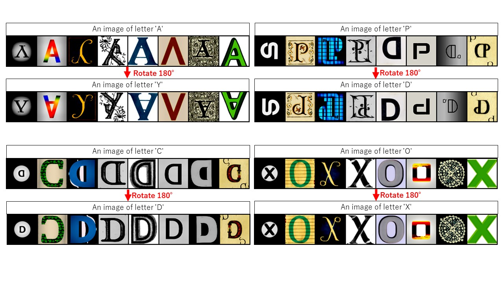
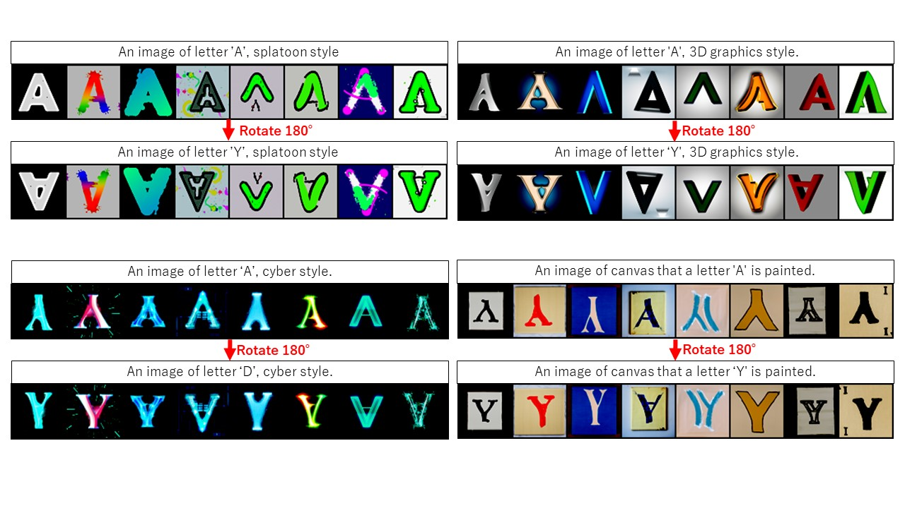
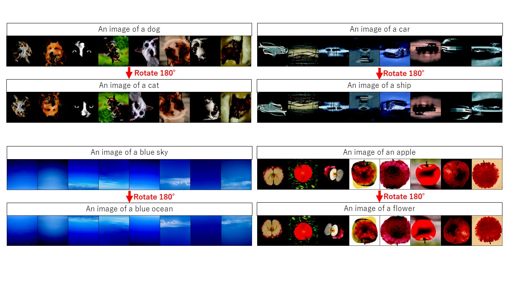

# Ambifusion2 
This is the updated version of [Ambifusion](https://github.com/univ-esuty/ambifusion).  
You can see the details of ambifusion(ver.1) in this paper: [ArXiv](https://arxiv.org/abs/2306.12049).  

## Abstract
In the flowing experiments, the pretrained large-scale Text2Img-diffusion models are used in our proposed ambigram generation modules.  
Therefore, The model can generate a variety of ambigram images, not only alphabet letter pairs but also diverse image pairs.  
In the following demo codes, we use [deep-floyed/IF](https://github.com/deep-floyd/IF) models as generation modules in the reverse process.

#### Generated Examples.
♦ Alphabet pair ambigrams  


♦ "A↕Y" ambigrams with different styles


♦ Image pair ambigrams


## Experiment Setup
Set up [diffusers](https://github.com/huggingface/diffusers/) environment.

## Demo
#### Gradio
1. Start gradio web app as following.
```
python demo.py
```
2. Access `127.0.0.1:11111` with your web browser.

#### Make ambigrams
1. Set `TestConfigs` in `ambigram_sample.py`.
2. Run the sampling code as following.
```
python ambigram_sample.py
```

#### Make ambigrams (higher resolution)
1. Set `TestConfigs` in `ambigram_sample_hr.py`.
2. Run the sampling code as following.
```
python ambigram_sample_hr.py
```

## Customize
You can change base generation model to other models such as `StableDiffusion`.  
But you might change some of the codes in the ambigram_pipeline.
